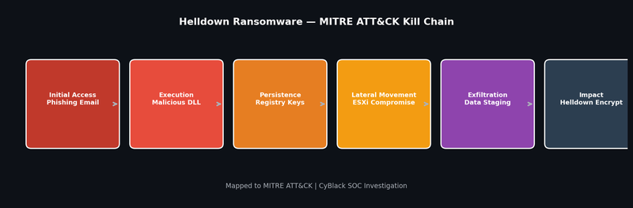

# Project 1 — Helldown Ransomware APT Investigation

## Overview

Led the full-lifecycle investigation of a confirmed Helldown ransomware campaign at CyBlack (UK), exhibiting APT-grade tradecraft including cross-platform impact across Windows and ESXi environments.

## Kill Chain Diagram

## Background

Helldown is a sophisticated ransomware family that targets both Windows and VMware ESXi hypervisors, encrypting virtual machine files to maximise operational disruption. The campaign was not surfaced by automated detection — it was identified through proactive threat hunting across SIEM logs and endpoint telemetry.

## Investigation Methodology

### Phase 1 — Detection & Scoping
- Identified anomalous file access patterns in Splunk Cloud logs during proactive threat hunt
- Correlated endpoint telemetry from CrowdStrike with SIEM alerts to determine scope
- Identified 3 Windows endpoints and 2 ESXi hosts as compromised

### Phase 2 — Malware Triage
- Analysed 50+ file hashes across VirusTotal and ANY.RUN sandbox
- Conducted static analysis of malicious DLL files — identified RAT indicators:
  - Persistence via registry run keys (HKCU\Software\Microsoft\Windows\CurrentVersion\Run)
  - Scheduled task creation for persistence
  - C2 communication over encrypted channels (port 443 beaconing)
  - Unsigned binary with invalid certificate chain

### Phase 3 — MITRE ATT&CK Mapping

| Tactic | Technique | ID |
|---|---|---|
| Initial Access | Phishing — Malicious Attachment | T1566.001 |
| Execution | User Execution — Malicious File | T1204.002 |
| Persistence | Registry Run Keys / Startup Folder | T1547.001 |
| Defence Evasion | Signed Binary Proxy Execution | T1218 |
| Lateral Movement | Remote Services — SMB/Windows Admin Shares | T1021.002 |
| Impact | Data Encrypted for Impact | T1486 |

### Phase 4 — YARA Rule Development

Designed custom YARA rules targeting:
- Ransomware note filename patterns
- Known byte sequences from the Helldown dropper
- Mutex names used by the malware
- File extension patterns used for encrypted files

### Phase 5 — Containment & Eradication
- Isolated all affected endpoints from the network
- Disabled compromised accounts and revoked active sessions
- Blocked C2 infrastructure at firewall and proxy
- Removed persistence mechanisms across all affected hosts
- Validated clean state through post-remediation scan

## Tools Used

| Tool | Purpose |
|---|---|
| Splunk Cloud | Log analysis, threat hunting, timeline reconstruction |
| CrowdStrike Falcon | EDR telemetry, process tree analysis |
| VirusTotal | Hash reputation and file analysis |
| ANY.RUN | Dynamic malware sandbox analysis |
| Python | Automated hash analysis across TI APIs |
| YARA | Custom detection rule development |

## Outcomes
- Full APT kill chain mapped to MITRE ATT&CK
- Cross-platform impact on Windows and ESXi uncovered and contained
- Custom YARA rules deployed to prevent reinfection
- Post-incident review produced 6 hardening recommendations implemented
- Detection gap closed — similar campaigns now detected within 2 hours
