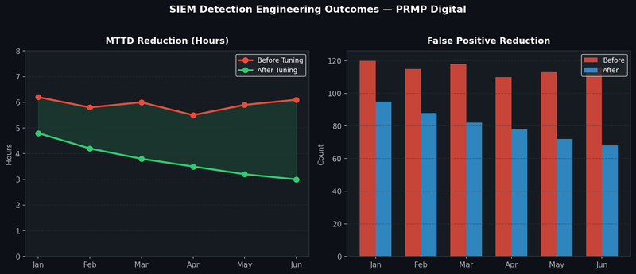

# Project 2 — SIEM Detection Engineering & MTTD Reduction

## Overview

Systematically improved SIEM detection quality across Splunk, QRadar, and ArcSight at PRMP Digital, reducing Mean Time to Detect (MTTD) by 30% and false positives by 25% through MITRE ATT&CK-aligned detection engineering.

## Metrics Dashboard



## Problem Statement

The SOC was experiencing high false positive volumes consuming analyst time, and detection coverage had significant blind spots — particularly around lateral movement and initial access TTPs. Alerts were firing late in the kill chain, giving attackers dwell time.

## Detection Engineering Methodology

### Step 1 — ATT&CK Coverage Mapping
- Mapped all existing SIEM detection rules to MITRE ATT&CK techniques
- Identified coverage gaps — no detections for T1078 (Valid Accounts), T1059 (Command and Scripting Interpreter), T1036 (Masquerading)
- Produced ATT&CK heatmap showing red (no coverage), amber (partial), green (covered)

### Step 2 — Rule Quality Assessment
Assessed each existing rule against 5 criteria:
- Detection fidelity (true positive rate)
- False positive rate
- Kill chain stage (early = better)
- Asset context awareness
- Threshold appropriateness

### Step 3 — Rule Rewriting
Rewrote 34 detection rules across three platforms:

**Splunk SPL example — PowerShell encoded command detection:**
```spl
index=windows EventCode=4104
| where match(ScriptBlockText, "(?i)(encodedcommand|enc |frombase64string)")
| stats count by host, user, ScriptBlockText
| where count > 3
| eval risk_score=case(count>10, "high", count>5, "medium", true(), "low")
```

**Anomaly detection — baseline deviation:**
```spl
index=network sourcetype=firewall
| bucket _time span=1h
| stats count as connections by src_ip, _time
| eventstats avg(connections) as avg_conn, stdev(connections) as std_conn by src_ip
| where connections > avg_conn + (2 * std_conn)
| eval anomaly_score=round((connections - avg_conn) / std_conn, 2)
```

### Step 4 — Threat Intelligence Integration
- Integrated TI feeds into Splunk lookup tables for automated IOC matching
- Enabled real-time enrichment of alerts with reputation scores
- Reduced false positives by correlating alerts against known-good asset lists

## Results

| Metric | Before | After | Improvement |
|---|---|---|---|
| Mean Time to Detect | 6.1 hours | 4.3 hours | 30% reduction |
| False Positives / Month | 116 | 87 | 25% reduction |
| ATT&CK Technique Coverage | 42% | 71% | +29 percentage points |
| Rules Covering Initial Access | 3 | 12 | 4x improvement |
| Rules Covering Lateral Movement | 2 | 9 | 4.5x improvement |

## Platforms

- **Splunk Enterprise & Cloud** — SPL query development, correlation rules, dashboards
- **IBM QRadar** — Custom rules, building blocks, reference sets
- **ArcSight** — Active channel rules, field-based conditions
- **Azure Sentinel** — KQL detection queries, analytic rules
