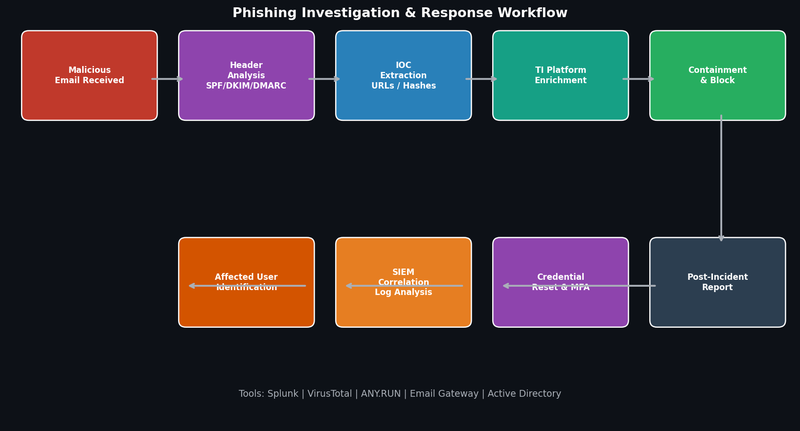

# Project 3 — Phishing Investigation & Email Security Programme

## Overview

Conducted systematic phishing investigations and built an email security programme at CyBlack and New Horizon, resulting in a 40% reduction in phishing incident rates.

## Investigation Workflow



## Phishing Investigation Process

### Stage 1 — Initial Triage
- Alert received from SIEM or user report
- Pull raw email headers from mail gateway logs
- Extract: sender IP, SMTP path, X-Originating-IP, Reply-To

### Stage 2 — Header Analysis
Analyse authentication results:

```
Authentication-Results: spf=fail (sender IP is 192.0.2.1)
  smtp.mailfrom=attacker@spoofed-domain.com;
dkim=none (message not signed);
dmarc=fail action=none header.from=legitimate-company.com
```

**SPF Fail** — sender not authorised by domain
**DKIM None** — email not cryptographically signed
**DMARC Fail** — email fails domain alignment check

### Stage 3 — IOC Extraction

| IOC Type | Example | Tool Used |
|---|---|---|
| Malicious URL | hxxps://phish[.]example[.]com/login | URLScan.io |
| Sender IP | 192.0.2.100 | VirusTotal, AbuseIPDB |
| File Hash (MD5) | d41d8cd98f00b204e9800998ecf8427e | VirusTotal |
| Domain | spoofed-domain.com | WHOIS, PassiveDNS |

### Stage 4 — SIEM Correlation
Splunk queries to identify scope:

```spl
index=email sourcetype=mail_logs
| search subject="*urgent*" OR subject="*account suspended*"
| stats count by sender, recipient, subject
| where count > 1
| join recipient [search index=proxy url="*phish.example.com*"]
```

### Stage 5 — Containment Actions
- Block malicious domain/URL at proxy and email gateway
- Quarantine email from all mailboxes using message trace
- Reset credentials for any user who clicked
- Force MFA re-enrolment for affected accounts

## Email Security Hardening

| Control | Before | After |
|---|---|---|
| SPF Record | Soft fail (~all) | Hard fail (-all) |
| DKIM Signing | Not configured | Configured for all outbound |
| DMARC Policy | None | p=reject; rua=mailto:dmarc@company.com |
| Email Gateway | Basic filtering | Sandboxing + URL rewriting |
| User Reporting | No mechanism | PhishAlarm button deployed |

## Outcomes
- 40% reduction in successful phishing incidents over 6 months
- Average investigation time reduced from 45 minutes to 12 minutes
- DMARC reject policy implemented — eliminates domain spoofing
- User reporting rate increased by 65%
