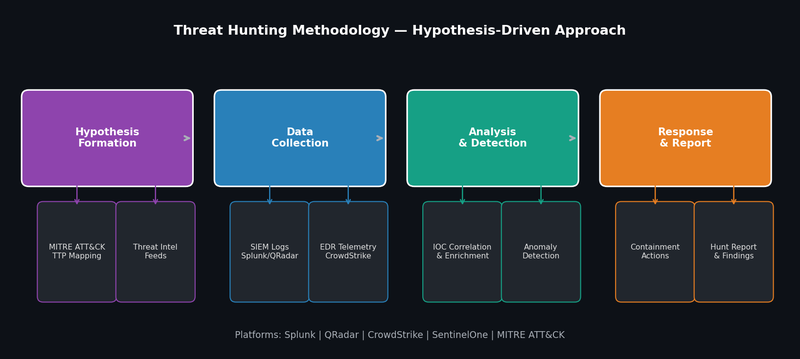

# Project 4 — Threat Hunting & IOC Investigation Programme

## Overview

Designed and executed hypothesis-driven threat hunting operations across enterprise SOC environments at PRMP Digital and CyBlack, identifying threats before automated detection fired.

## Hunting Methodology



## Hunting Methodology — 4-Phase Approach

### Phase 1 — Hypothesis Formation
Every hunt starts with a hypothesis based on:
- **Threat Intelligence** — recent APT campaigns, CISA KEV, vendor advisories
- **MITRE ATT&CK** — techniques not covered by existing detection rules
- **Environmental knowledge** — known weak points in the organisation's infrastructure

Example hypothesis:
> *"Threat actors may have established persistence via scheduled tasks on Windows servers that are not covered by our current detection rules (T1053.005)"*

### Phase 2 — Data Collection

| Data Source | Platform | What We Hunt |
|---|---|---|
| Windows Event Logs | Splunk | Event IDs 4698, 4702 (scheduled task creation/modification) |
| EDR Telemetry | CrowdStrike | Process trees, parent-child relationships |
| Network Flows | Zeek/Wireshark | Unusual outbound connections, beaconing |
| DNS Logs | Splunk | DGA domain patterns, newly registered domains |
| Authentication Logs | Azure AD / Splunk | Impossible travel, unusual login times |

### Phase 3 — Analysis Techniques

**Stack Counting** — identify statistical outliers:
```spl
index=windows EventCode=4698
| stats count by TaskName, ComputerName
| sort count asc
| head 20
```

**Frequency Analysis** — detect beaconing:
```spl
index=network
| bucket _time span=1m
| stats count by src_ip, dest_ip, dest_port, _time
| stats stdev(count) as jitter, avg(count) as freq by src_ip, dest_ip, dest_port
| where jitter < 2 AND freq > 5
```

**Parent-Child Process Anomaly:**
```spl
index=windows EventCode=4688
| where ParentProcessName="winword.exe" AND NewProcessName IN ("cmd.exe","powershell.exe","wscript.exe")
| table _time, ComputerName, ParentProcessName, NewProcessName, CommandLine
```

### Phase 4 — IOC Investigation & Documentation

For each identified IOC:

| Field | Description |
|---|---|
| IOC Value | Exact hash, IP, domain, or file path |
| IOC Type | Hash / IP / Domain / URL / File Path |
| Confidence | High / Medium / Low |
| TI Reputation | VirusTotal score, AbuseIPDB reports |
| First Seen | Timestamp in environment |
| Affected Assets | List of impacted hosts/users |
| MITRE Technique | ATT&CK TTP mapping |
| Disposition | Confirmed malicious / Suspicious / Benign |
| Action Taken | Block / Monitor / Escalate / Close |

## Hunt Results Summary

| Hunt | Hypothesis | Finding | Outcome |
|---|---|---|---|
| Hunt 001 | Scheduled task persistence | 2 suspicious tasks on 3 hosts | Confirmed C2 — incident raised |
| Hunt 002 | Living-off-the-land binaries | LOLBin abuse by legitimate process | Tuned detection rule deployed |
| Hunt 003 | Credential dumping via LSASS | No evidence found | Detection coverage confirmed |
| Hunt 004 | Lateral movement via WMI | Unusual WMI activity from workstation | Insider threat investigation opened |

## Tools Used
- **Splunk** — Primary hunting platform, SPL queries
- **CrowdStrike Falcon** — EDR telemetry, process analysis
- **SentinelOne** — Endpoint activity investigation
- **MITRE ATT&CK Navigator** — Coverage mapping and gap analysis
- **VirusTotal / ANY.RUN** — IOC enrichment and validation
