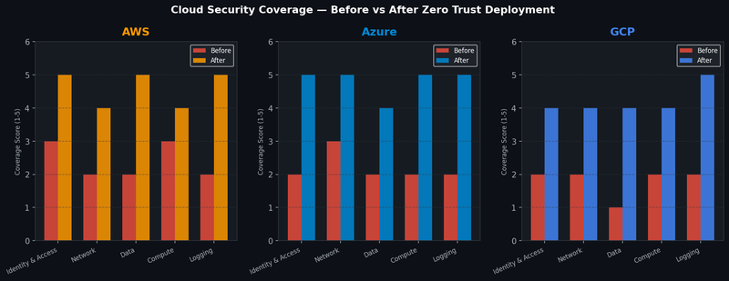

# Project 5 — Cloud Threat Detection & Zero Trust Deployment

## Overview

Configured and tuned cloud-native security tooling across AWS, Azure, and GCP at PRMP Digital, and led zero-trust access control deployment that reduced unauthorised access risks by 35%.

## Coverage Improvement



## Cloud Security Architecture

### AWS Security Stack
| Service | Purpose | Configuration |
|---|---|---|
| AWS GuardDuty | Threat detection | CloudTrail + VPC Flow Logs + DNS logs analysis |
| AWS Security Hub | Centralised findings | CIS AWS Benchmark + NIST 800-53 standards |
| AWS Config | Configuration compliance | 47 managed rules enabled |
| CloudTrail | API activity logging | Multi-region trail, S3 + CloudWatch integration |
| VPC Flow Logs | Network traffic analysis | All VPCs, 14-day retention |

### Azure Security Stack
| Service | Purpose | Configuration |
|---|---|---|
| Microsoft Sentinel | SIEM + SOAR | 23 analytic rules, 8 automation playbooks |
| Defender for Cloud | Workload protection | Defender for Servers P2, Defender for SQL |
| Entra ID | Identity protection | Conditional Access, PIM for privileged roles |
| Azure Monitor | Log aggregation | Activity logs + Diagnostic settings |

### GCP Security Stack
| Service | Purpose | Configuration |
|---|---|---|
| Security Command Center | Threat detection | Premium tier, 12 built-in detectors |
| Cloud Audit Logs | Activity logging | Admin activity + Data access logs |
| VPC Service Controls | Data exfiltration prevention | Perimeter around sensitive projects |

## Zero Trust Implementation

### Principles Applied
1. **Verify Explicitly** — Every access request authenticated and authorised regardless of location
2. **Least Privilege Access** — Minimum permissions required for each role
3. **Assume Breach** — Segment networks, verify end-to-end encryption, use analytics

### Implementation Steps

| Step | Action | Platform | Outcome |
|---|---|---|---|
| 1 | Enforce MFA for all privileged access | All platforms | Eliminated credential-only auth |
| 2 | Deploy Just-In-Time access | AWS IAM + Azure PIM | Eliminated standing privileged access |
| 3 | Implement Conditional Access | Azure Entra ID | Device compliance checks enforced |
| 4 | Right-size permissions | AWS IAM + GCP IAM | 847 over-privileged roles removed |
| 5 | Enable Privileged Identity Management | Azure PIM | JIT access for all Global Admins |
| 6 | Network segmentation | AWS VPC + Azure VNet | Micro-segmentation across workloads |

## Key Detection Rules Deployed

**Impossible Travel Detection (Sentinel KQL):**
```kql
SigninLogs
| where TimeGenerated > ago(1h)
| summarize Locations=makeset(Location), Count=count() by UserPrincipalName
| where array_length(Locations) > 1
| mv-expand Location=Locations
| join kind=inner (SigninLogs | project UserPrincipalName, Location, TimeGenerated)
  on UserPrincipalName, Location
| where datetime_diff('minute', TimeGenerated, prev(TimeGenerated)) < 60
```

**GuardDuty High Severity Alert to Splunk:**
```python
import boto3
import json

def lambda_handler(event, context):
    finding = event['detail']
    severity = finding['severity']
    if severity >= 7.0:
        # Forward to Splunk HEC
        payload = {
            "event": json.dumps(finding),
            "sourcetype": "aws:guardduty",
            "index": "security"
        }
        # POST to Splunk HEC endpoint
```

## Outcomes
- 35% reduction in unauthorised access risk
- 847 over-privileged IAM roles removed
- Zero trust deployment across 3 cloud platforms
- Detection coverage increased from 42% to 78% of cloud ATT&CK techniques
