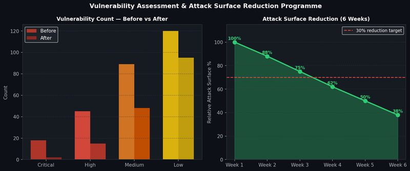

# Project 6 — Vulnerability Assessment & Attack Surface Reduction

## Overview

Led a structured vulnerability assessment and remediation programme at CyBlack and PRMP Digital using Nessus, reducing the overall attack surface by 30% through risk-prioritised remediation.

## Assessment Results



## Assessment Methodology

### Phase 1 — Scoping & Baseline
- Defined assessment scope: all internet-facing and internal systems
- Conducted asset discovery using Nessus network scan + asset register reconciliation
- Established baseline vulnerability inventory before remediation

### Phase 2 — Scanning

| Scan Type | Target | Tool | Frequency |
|---|---|---|---|
| Credentialed Internal Scan | All servers and workstations | Nessus Professional | Weekly |
| Non-Credentialed External Scan | Internet-facing assets | Nessus + Qualys | Monthly |
| Web Application Scan | Public web apps | Nessus + OWASP ZAP | Monthly |
| Cloud Configuration Scan | AWS / Azure / GCP | AWS Security Hub / Defender for Cloud | Continuous |

### Phase 3 — Risk-Prioritised Triage

Not purely CVSS-based. Contextualised scoring model:

```
Contextualised Risk Score = CVSS Base Score
  × Asset Criticality Multiplier (1.0 - 2.0)
  × Exposure Factor (0.5 - 1.5)
  × Exploitation Status (1.0 if not on CISA KEV, 2.0 if on CISA KEV)
```

### Phase 4 — Remediation Tracking

| Severity | SLA | Verification Method |
|---|---|---|
| Critical | 48 hours | Rescan + manual confirmation |
| High | 7 days | Rescan confirmation |
| Medium | 30 days | Automated rescan |
| Low | 90 days | Automated rescan |

### Phase 5 — Automation with Ansible

Ansible playbook for automated Nginx patching:
```yaml
---
- name: Patch Nginx vulnerability CVE-2024-XXXX
  hosts: web_servers
  become: yes
  tasks:
    - name: Check current Nginx version
      command: nginx -v
      register: nginx_version

    - name: Update Nginx to patched version
      apt:
        name: nginx=1.26.3-1~focal
        state: present
        update_cache: yes
      when: "'1.15' in nginx_version.stderr"

    - name: Verify patched version
      command: nginx -v
      register: new_version

    - name: Restart Nginx service
      service:
        name: nginx
        state: restarted
```

## Results

| Metric | Before | After |
|---|---|---|
| Critical Vulnerabilities | 18 | 2 |
| High Vulnerabilities | 45 | 15 |
| Overall Attack Surface | Baseline (100%) | 70% (30% reduction) |
| Average Patch Time (Critical) | 12 days | 36 hours |
| SLA Adherence | 67% | 100% |

## Tools Used
- **Nessus Professional** — Primary vulnerability scanner
- **Qualys** — Cloud-based scanning for external assets
- **OpenVAS** — Open source scanning for budget-constrained scope
- **Ansible** — Automated patch deployment and configuration hardening
- **Python** — Custom scripts for Nessus API integration and reporting
