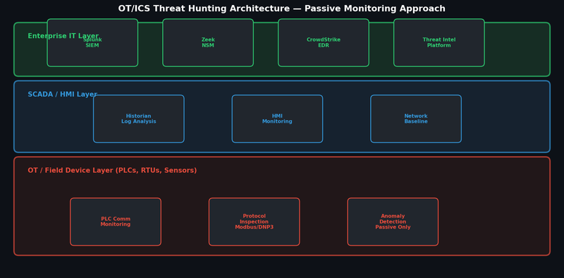

# Project 7 — OT/ICS Threat Hunting

## Overview

Conducted threat hunting and anomaly detection across OT/IT converged environments at New Horizon using passive monitoring techniques, identifying ICS security events without disrupting operational processes.

## Architecture



## Why OT/ICS Threat Hunting is Different

| Aspect | IT Environment | OT/ICS Environment |
|---|---|---|
| Scanning approach | Active scanning acceptable | Passive only — active scanning can disrupt PLCs |
| Patch management | Regular patching cycles | Rarely patched — legacy systems common |
| Availability priority | CIA (Confidentiality first) | AIC (Availability first) |
| Protocols | TCP/IP, HTTP, TLS | Modbus, DNP3, PROFINET, IEC 61850 |
| Asset inventory | Usually documented | Often undocumented, legacy systems |
| Incident response | Immediate containment | Must consult operations team before isolation |

## Passive Monitoring Architecture

### Network Tap Strategy
- SPAN port configured on the switch connecting IT and OT networks
- Zeek deployed on a dedicated sensor — read-only, no traffic injection
- All OT network traffic captured for offline analysis

### Data Sources Monitored

| Source | Data Collected | Tool |
|---|---|---|
| Network traffic | All OT protocol communication | Zeek + Wireshark |
| Historian logs | Process variable trends and setpoints | Custom Python parser |
| HMI audit logs | Operator commands and alarms | Log forwarding to Splunk |
| Engineering workstation | Software installations, remote access | CrowdStrike (IT boundary) |
| Firewall logs | IT-OT boundary traffic | Splunk |

## ICS-Specific Threat Indicators

### Anomalous Modbus Traffic
Normal Modbus patterns:
- PLC polling every 100-500ms from known SCADA IP
- Function codes: FC01 (Read Coils), FC03 (Read Holding Registers)

Suspicious indicators:
- New source IP sending Modbus commands
- FC16 (Write Multiple Registers) from unexpected source
- Polling frequency change (may indicate reconnaissance)

### Zeek ICS Protocol Detection:
```zeek
event modbus_message(c: connection, headers: ModbusHeaders, is_orig: bool)
{
    if ( headers$function_code == 16 )  # Write Multiple Registers
    {
        local known_masters: set[addr] = { 192.168.10.5, 192.168.10.6 };
        if ( c$id$orig_h !in known_masters )
        {
            NOTICE([$note=Modbus::Unauthorized_Write,
                   $msg=fmt("Unauthorized Modbus write from %s", c$id$orig_h),
                   $conn=c]);
        }
    }
}
```

## Hunt Findings

| Finding | Severity | Description | Action |
|---|---|---|---|
| Unauthorised Modbus write command | High | Unknown IP sending FC16 to PLC | Investigated — maintenance laptop, not authorised. Added to approved list after verification |
| HMI remote session outside hours | Medium | Remote desktop to HMI at 02:00 AM | Confirmed authorised on-call engineer. Added time-based alert tuning |
| New device on OT network | High | Unknown MAC address on OT VLAN | Rogue engineering laptop — removed, network access controls tightened |
| Historian data spike | Low | Unusual volume of read requests | Confirmed new reporting tool. Whitelisted |

## Outcomes
- 3 previously unknown devices identified on OT network
- Unauthorised Modbus write commands detected and investigated
- Detection rules deployed for OT anomalies without disrupting operations
- Passive monitoring architecture documented for ongoing use
