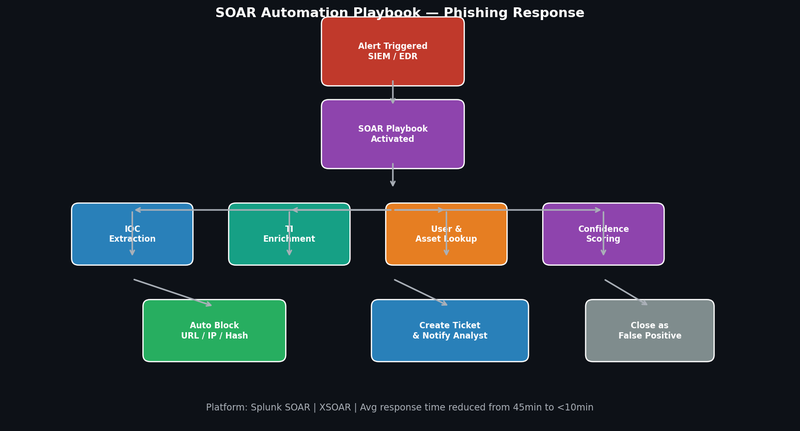

# Project 8 — SOAR Automation & Playbook Development

## Overview

Built and deployed automated incident response playbooks in Splunk SOAR and XSOAR at PRMP Digital, reducing average phishing investigation time from 45 minutes to under 10 minutes.

## Playbook Architecture



## Playbooks Developed

### Playbook 1 — Phishing Triage & Response (Primary)

**Trigger:** SIEM phishing alert OR user-reported suspicious email

**Automated Actions:**
1. Extract all IOCs from email (sender, URLs, file hashes, headers)
2. Query VirusTotal API for URL and hash reputation
3. Check proxy logs for any users who clicked the URL
4. Query Active Directory for affected user's group membership and access level
5. Calculate confidence score based on IOC reputation + click data
6. If confidence > 80%: auto-block URL at proxy, quarantine email in all mailboxes
7. Create incident ticket with pre-populated findings
8. Notify SOC analyst with full triage summary

**Python enrichment function:**
```python
import phantom.rules as phantom
import json

def enrich_iocs(action=None, success=None, container=None, results=None, **kwargs):
    iocs = phantom.collect2(container=container, datapath=['artifact:*.cef.requestURL'])
    for ioc in iocs:
        url = ioc[0]
        phantom.act(
            'lookup url',
            parameters=[{'url': url}],
            assets=['virustotal'],
            callback=score_ioc,
            name='vt_lookup'
        )
```

**Results:**
- Average investigation time: 45 min → 8 min (82% reduction)
- Analyst handles only confirmed threats
- Auto-blocks executed in <2 minutes of alert

---

### Playbook 2 — Brute Force Response

**Trigger:** >10 failed logins within 5 minutes from same source

**Automated Actions:**
1. Pull all failed login events for source IP from last 24hrs
2. Check IP reputation against TI feeds
3. Identify target accounts and check for any successful logins
4. If successful login found: force password reset, revoke sessions, alert user
5. Block source IP at firewall if reputation score > 70
6. Create incident ticket with timeline

---

### Playbook 3 — Malware Alert Response

**Trigger:** EDR malware detection (CrowdStrike / SentinelOne)

**Automated Actions:**
1. Pull full process tree from EDR API
2. Extract all file hashes, network connections, registry changes
3. Submit unknown hashes to sandbox (ANY.RUN)
4. Query SIEM for lateral movement from affected host
5. Calculate blast radius — how many hosts communicated with affected host
6. If high severity: auto-isolate host via EDR API
7. Page on-call analyst with full context

---

## SOAR Platform Comparison

| Feature | Splunk SOAR | XSOAR (Palo Alto) |
|---|---|---|
| Playbook language | Python + Visual | Python + YAML |
| Integrations | 300+ apps | 700+ integrations |
| Case management | Built-in | Built-in |
| Community | Splunkbase | XSOAR Marketplace |
| Best for | Splunk-heavy environments | Multi-vendor environments |

## Automation Outcomes

| Metric | Before Automation | After Automation |
|---|---|---|
| Phishing investigation time | 45 minutes | 8 minutes |
| Brute force response time | 35 minutes | 4 minutes |
| Malware triage time | 60 minutes | 15 minutes |
| Alert volume handled | 40/day (manual) | 200+/day (automated) |
| False positive escalations | 65% of alerts | 18% of alerts |
| Analyst focus | Repetitive triage | Complex investigation |

## Tools & Integrations
- **Splunk SOAR** — Primary automation platform
- **XSOAR** — Secondary platform for multi-vendor environments
- **VirusTotal API** — IOC enrichment
- **ANY.RUN API** — Automated sandbox submission
- **CrowdStrike API** — Host isolation and telemetry
- **Active Directory** — User and asset context
- **Jira / ServiceNow** — Ticket creation
